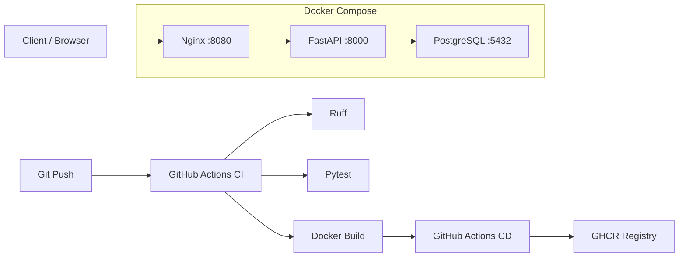

# FastAPI DevOps Portfolio


Production-like REST API на **FastAPI** с **PostgreSQL**, контейнеризацией через **Docker**, оркестрацией через **Docker Compose**, reverse proxy на **Nginx** и автоматизацией через **GitHub Actions** + **GHCR**.

Учебный DevOps-проект для портфолио: демонстрирует полный цикл от локальной разработки до публикации Docker-образа в registry.

## Стек

| Категория | Технологии |
|-----------|------------|
| Backend | FastAPI, Uvicorn, Pydantic Settings |
| Database | PostgreSQL 16, SQLAlchemy 2, Alembic |
| Infrastructure | Docker, Docker Compose, Nginx |
| CI/CD | GitHub Actions, GitHub Container Registry (GHCR) |
| Quality | Ruff, Pytest, httpx |

## Архитектура



**Поток запросов:** клиент обращается к Nginx (`localhost:8080`), Nginx проксирует запросы во внутренний FastAPI-контейнер. FastAPI работает с PostgreSQL через SQLAlchemy. Снаружи доступен только Nginx — приложение и БД изолированы в Docker-сети.

## Возможности

- REST API с CRUD для сущности `Item`
- Health-check с проверкой доступности PostgreSQL (`GET /health`)
- Версионирование схемы БД через Alembic migrations
- Multi-stage Dockerfile (non-root user, HEALTHCHECK)
- Docker Compose: app + postgres + nginx с healthchecks и named volumes
- CI: lint → test → docker build
- CD: автоматический push образа в GHCR при merge в `main`

## Быстрый старт

### Требования

- Docker & Docker Compose
- Git

### 1. Клонирование и настройка окружения

```bash
git clone https://github.com/SkywalkerERR/fastapi-devops.git
cd fastapi-devops
cp .env.example .env
```

Заполни `.env` (пример):

```env
POSTGRES_USER=postgres
POSTGRES_PASSWORD=your_secure_password
POSTGRES_DB=fastapi_db
POSTGRES_PORT=5432
POSTGRES_HOST_PORT=5433
APP_PORT=8000

DB_HOST=localhost
DB_PORT=5433
DB_USER=postgres
DB_PASSWORD=your_secure_password
DB_NAME=fastapi_db
```

> **Примечание:** внутри Docker Compose приложение подключается к Postgres по хосту `postgres` и порту `5432`. Переменные `DB_*` в `.env` используются для локального запуска без Docker.

### 2. Запуск стека

```bash
docker compose up --build -d
```

### 3. Применение миграций

```bash
docker compose exec app alembic upgrade head
```

### 4. Проверка

```bash
curl http://localhost:8080/health
curl http://localhost:8080/items/
```

Swagger UI: [http://localhost:8080/docs](http://localhost:8080/docs)

## API

| Method | Endpoint | Описание |
|--------|----------|----------|
| `GET` | `/` | Информация о сервисе |
| `GET` | `/health` | Health-check (включая проверку БД) |
| `GET` | `/items/` | Список items |
| `POST` | `/items/` | Создание item |
| `GET` | `/docs` | Swagger UI (через Nginx) |

### Пример создания item

```bash
curl -X POST http://localhost:8080/items/ \
  -H "Content-Type: application/json" \
  -d '{"name": "first item", "description": "hello from portfolio project"}'
```

PowerShell:

```powershell
Invoke-RestMethod -Method Post -Uri http://localhost:8080/items/ `
  -ContentType "application/json" `
  -Body '{"name":"first item","description":"hello from portfolio project"}'
```

## Структура проекта

```
fastapi-devops/
├── app/
│   ├── api/           # API routers
│   ├── core/          # Settings, config
│   ├── db/            # SQLAlchemy engine, session
│   ├── models/        # ORM models
│   └── main.py        # FastAPI entrypoint
├── alembic/           # Database migrations
├── nginx/             # Nginx reverse proxy config
├── tests/             # Pytest tests
├── .github/workflows/ # CI/CD pipelines
├── Dockerfile
├── docker-compose.yml
└── requirements.txt
```

## Docker-образ

Образ публикуется автоматически в GHCR при push в `main`:

```bash
docker pull ghcr.io/skywalkererr/fastapi-devops:1.0.0
```

Также доступен тег с SHA коммита: `ghcr.io/skywalkererr/fastapi-devops:<commit-sha>`

## CI/CD

### CI (`.github/workflows/ci.yml`)

Запускается на `push` / `pull_request` в `main` и `develop`:

1. **lint** — `ruff check app/`
2. **test** — `pytest tests/`
3. **build** — `docker build`

### CD (`.github/workflows/cd.yml`)

Запускается на `push` в `main`:

1. Login в GitHub Container Registry
2. Build & push Docker-образа с тегами `1.0.0` и `<commit-sha>`

## Локальная разработка (без Docker)

```bash
python -m venv .venv
source .venv/bin/activate        # Linux/macOS
# .venv\Scripts\Activate.ps1     # Windows

pip install -r requirements-dev.txt
uvicorn app.main:app --reload
```

Для работы с БД локально подними только Postgres:

```bash
docker compose up -d postgres
alembic upgrade head
```

## Полезные команды

```bash
# Статус контейнеров
docker compose ps

# Логи приложения
docker compose logs -f app

# Список таблиц в БД
docker compose exec postgres psql -U postgres -d fastapi_db -c "\dt"

# Остановка стека
docker compose down

# Остановка + удаление volumes (данные БД будут удалены!)
docker compose down -v
```

## Что можно улучшить дальше

- [ ] Разделение dev/prod конфигураций (`docker-compose.prod.yml`)
- [ ] Отключение Swagger в production
- [ ] Secrets management (GitHub Secrets / Vault)
- [ ] HTTPS через Nginx + Let's Encrypt
- [ ] Мониторинг (Prometheus + Grafana)

## Автор

[SkywalkerERR](https://github.com/SkywalkerERR)
